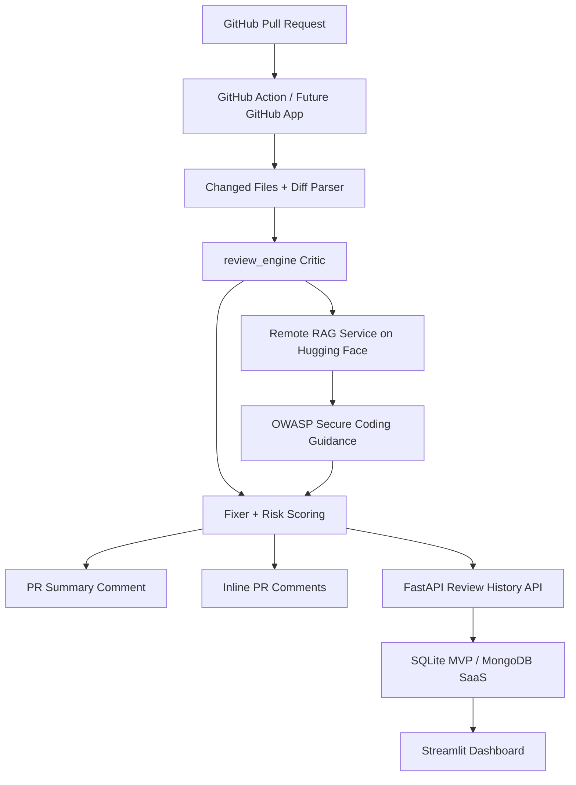

# CodeSecAudit AI

Enterprise AI Pull Request Reviewer for Security, Code Quality, and RAG-based Secure Coding Guidance

CodeSecAudit AI acts like an AI senior engineer inside GitHub pull requests, detecting risky code, posting inline comments, suggesting fixes, and tracking review analytics before code is merged.

[](https://www.python.org/)
[](https://fastapi.tiangolo.com/)
[](https://docs.docker.com/compose/)
[](https://huggingface.co/datasets/OMCHOKSI108/CodeSecAudit-RAG)
[](https://OMCHOKSI108-codereview-agent.hf.space)
[](https://www.kaggle.com/code/omchoksi04/codereview)
[](LICENSE)

---

## Live Links

| Asset | Link |
|---|---|
| Kaggle Notebook | https://www.kaggle.com/code/omchoksi04/codereview |
| Hugging Face Dataset | https://huggingface.co/datasets/OMCHOKSI108/CodeSecAudit-RAG |
| RAG Service (live) | https://OMCHOKSI108-codereview-agent.hf.space |
| GitHub Repo | https://github.com/OMCHOKSI108/codesec-audit-dataset |
| Deploy PR | https://github.com/OMCHOKSI108/codesec-audit-dataset/pull/1 |

---

## What Problem It Solves

- **Manual PR reviews are slow** — context-switching between diff view and security checklists costs teams hours per week.
- **Security issues slip through** — CWE-94 (code injection), CWE-89 (SQLi), and CWE-78 (command injection) are routinely missed in handwritten reviews.
- **Junior developers need guidance** — without inline, specific feedback, recurring vulnerabilities go unfixed.
- **Teams need review history** — without analytics, there is no way to track security debt or review velocity across repos.

CodeSecAudit AI addresses all four: automated detection with OWASP-aligned rules, optional RAG-based secure coding guidance, inline PR comments with fix suggestions, and a dashboard for review analytics.

---

## Product Features

| Feature | Details |
|---|---|
| **GitHub Action PR review** | Triggers on `opened`, `synchronize`, `reopened` — reviews `.py`, `.js`, `.ts` files |
| **Summary comment** | Posts a markdown table with verdict, risk score, CWE breakdown, and suggested fixes |
| **Inline file/line comments** | Posts comments directly on vulnerable lines in the PR diff (capped at 10) |
| **7 CWE detectors** | CWE-94, CWE-89, CWE-78, CWE-328, CWE-798, CWE-22, CWE-918 |
| **Severity + risk score** | Weighted severity produces a 0–100 risk score and verdict (APPROVE / WARNING / REQUEST_CHANGES) |
| **Suggested fixes** | Template-based per CWE — tells the developer exactly what to change |
| **RAG secure guidance** | Optional retrieval from 2,833 OWASP cheat sheet chunks for contextual advice |
| **Review history DB** | Every review saved to SQLite with search by repo, PR number, verdict, date |
| **Dashboard analytics** | Verdict distribution, risk trends, CWE breakdown, review detail viewer |
| **Usage-limit SaaS design** | Schema ready for free-tier caps, plan enforcement, and owner contact |
| **Resend email workflow design** | Welcome, usage guide, limit-reached notification templates |
| **MongoDB Atlas design** | 7-collection schema for users, installations, reviews, plans, email events |

---

## Architecture



For detailed architecture including the review pipeline, RAG service internals, and SaaS future, see [docs/architecture.md](docs/architecture.md).

---

## Repository Structure

```
review_engine/         Core: critic, fixer, retriever, pipeline, schemas, remote RAG client
rag_service/           Standalone FastAPI microservice for RAG (deployed on HF Space)
review_store/          SQLite persistence layer with repository pattern
api/                   FastAPI application with review and history endpoints
ui/                    Streamlit apps: review interface + analytics dashboard
scripts/               CLI, evaluation, smoke test, RAG index builder, deploy helpers
examples/              Demo files: vulnerable_pr_demo.py, safe_pr_demo.py
eval/                  Golden test cases for regression testing (12 cases)
deploy/                HF Space Dockerfile, start script, deploy README
docs/                  Architecture, API reference, GitHub Action, RAG service, Docker, deployment
.github/workflows/     GitHub Action workflow definition
```

---

## Dataset — CodeSecAudit-RAG

The custom dataset powers both rule-based evaluation and the RAG retrieval service.

| Metric | Value |
|---|---|
| Total review records | 28,548 |
| RAG corpus chunks | 2,833 |
| Embedding model | `all-MiniLM-L6-v2` (384-dim) |
| Similarity | Cosine |
| Sources | CodeXGLUE + OWASP Benchmark Python + OWASP Cheat Sheet Series |

**Hugging Face Dataset**: https://huggingface.co/datasets/OMCHOKSI108/CodeSecAudit-RAG

**Build the index locally**:
```bash
python scripts/build_rag_index.py
```

---

## Kaggle Notebook

Explore the dataset, RAG corpus, and a prototype Critic → Retriever → Fixer pipeline on Kaggle:

https://www.kaggle.com/code/omchoksi04/codereview

The notebook demonstrates:
- Dataset exploration (28,548 records from CodeXGLUE + OWASP)
- RAG corpus embedding and similarity search
- Prototype review pipeline

---

## Quickstart

### Local (no Docker)

```bash
pip install -e ".[dev]"
python scripts/review_code.py --code "eval(user_input)" --json
```

### Docker Compose (lightweight, rules-only)

```bash
docker compose up --build
```

### Access the services

| Service | URL |
|---|---|
| API | http://localhost:8003 |
| API docs (Swagger) | http://localhost:8003/docs |
| Review UI | http://localhost:8501 |
| Dashboard | http://localhost:8502 |

See [docs/docker.md](docs/docker.md) for RAG mode and build options.

---

## GitHub Action Usage

The workflow at `.github/workflows/codesec-audit.yml` triggers automatically on `pull_request: [opened, synchronize, reopened]`.

**What it does**:
1. Checks out the PR branch
2. Installs the CodeSecAudit package
3. Runs `scripts/github_pr_review.py` — reviews changed `.py`, `.js`, `.ts` files
4. Posts a **summary comment** with verdict, risk score, and issue table
5. Posts **inline comments** on vulnerable lines (max 10)
6. Skips lines without duplicates (detected via issue fingerprint)

**Limitations**:
- `use_rag=False` in CI (RAG caching not yet configured)
- Non-blocking — always exits 0
- No paid LLMs; all detection is rule-based

### Dry-run locally

```bash
python scripts/github_pr_review.py --files examples/vulnerable_pr_demo.py --dry-run
```

Full documentation: [docs/github_action.md](docs/github_action.md)

---

## RAG Service

The RAG retrieval service runs as a **separate Hugging Face Space** to keep the main deployment lightweight (~500 MB).

**Live endpoint**: https://OMCHOKSI108-codereview-agent.hf.space

| Endpoint | Method | Description |
|---|---|---|
| `/health` | GET | Health check with index status |
| `/rag/search` | POST | Search OWASP guidance by query |

### Enable remote RAG in your environment

```env
CODESEC_ENABLE_RAG=true
CODESEC_RAG_MODE=remote
CODESEC_RAG_SERVICE_URL=https://OMCHOKSI108-codereview-agent.hf.space
CODESEC_RAG_API_KEY=your-key-here
```

Fallback: if the remote RAG service is unreachable, the review completes in rules-only mode with a `rag_error` in metadata.

Full documentation: [docs/rag_service.md](docs/rag_service.md)

---

## Evaluation

12 golden cases span all 7 supported CWEs and verify correctness after every change.

```bash
python scripts/evaluate_reviewer.py
python scripts/smoke_test_demo_files.py
```

| Metric | Status |
|---|---|
| Golden cases | 12 |
| Passing | 12/12 |
| Multi-hit detection | 3 per rule max, 20 total max |
| Safe file | Returns `APPROVE` with 0 issues |
| Vulnerable demo | Returns `REQUEST_CHANGES` with multiple CWEs |

Full documentation: [docs/evaluation.md](docs/evaluation.md)

---

## API Endpoints

| Endpoint | Method | Description |
|---|---|---|
| `/` | GET | Root info — uptime, version, configuration |
| `/health` | GET | Health check with RAG index status |
| `/review` | POST | Review code (no persistence) |
| `/review/code` | POST | Review code and save to history DB |
| `/reviews` | GET | List past reviews (paginated) |
| `/reviews/{id}` | GET | Single review with full issue details |
| `/stats` | GET | Aggregated analytics |

Full API reference with request/response examples: [docs/api_reference.md](docs/api_reference.md)

---

## Deployment Strategy

| Component | Host | Status |
|---|---|---|
| RAG Service | Hugging Face Space | **Live** |
| API + Dashboard | Render / Railway | Planned |
| Database | MongoDB Atlas | Designed |
| Email | Resend | Designed |
| GitHub App | GitHub Marketplace | Planned |

See [docs/deployment_strategy.md](docs/deployment_strategy.md) and [docs/deployment_status.md](docs/deployment_status.md).

---

## SaaS Future (Planned)

The user flow for the SaaS version:

1. Developer clicks **Install** on the GitHub App README badge
2. GitHub App installs in the developer's repo or org
3. Developer signs in via **GitHub OAuth**
4. Dashboard shows review history, analytics, and settings
5. Free tier: **30 PR reviews / month**
6. Limit reached → Resend email with upgrade prompt
7. Contact owner for custom plans

Owner contact: **omchoksi108@gmail.com**

Current status:
- [x] Datasets + RAG corpus
- [x] Kaggle notebook
- [x] CLI reviewer
- [x] FastAPI API
- [x] GitHub Action
- [x] Inline PR comments
- [x] Evaluation
- [x] Review history DB
- [x] Dashboard
- [x] Docker
- [x] Remote RAG service (deployed)
- [x] Render deployment
- [x] MongoDB Atlas integration
- [x] Resend email implementation
- [x] GitHub OAuth
- [x] GitHub App install flow
- [ ] Usage limit enforcement

---

## Website / SaaS Portal

Public product portal at **https://codesec-website.onrender.com**

- **Landing page** — Product features, GitHub App install CTA, sign in CTA
- **GitHub OAuth login** — Sign in with your GitHub account
- **Email OTP verification** — 6-digit code via Resend, 10-minute expiry
- **Dashboard** — Usage tracking, recent reviews, install GitHub App
- **Reviews page** — PR review history from the FastAPI backend
- **Usage page** — 30 free PR reviews/month, remaining quota, reset date
- **Repos page** — Connected repository management (placeholder)
- **Contact page** — Owner contact for plan increases

### GitHub OAuth Flow

1. Click "Sign in with GitHub" → redirected to GitHub OAuth
2. Authorize → callback exchanges code for access token
3. GitHub profile + primary email fetched
4. User saved/updated in MongoDB
5. If email not verified → OTP verification page
6. After verification → dashboard

### OTP Verification

- 6-digit numeric code via Resend email
- Expires in 10 minutes
- Max 3 send attempts per 10 minutes
- Max 3 verify attempts per OTP
- OTP stored as SHA-256 hash (never plaintext)

### Usage Display

- 30 PR reviews per month on the free plan
- Dashboard shows used / remaining / limit with progress bar
- Contact owner for more usage when limit reached

---

## Responsible Use

CodeSecAudit AI is a **defensive security tool**:
- It detects vulnerabilities — it does not exploit them.
- It is not a replacement for professional SAST tools or manual security review.
- It is designed for **educational and secure-code-review purposes**.
- Do not use it for offensive automation or vulnerability research on systems you do not own.

---

## Owner Contact

For questions, custom plans, or limit increases:

**omchoksi108@gmail.com**
