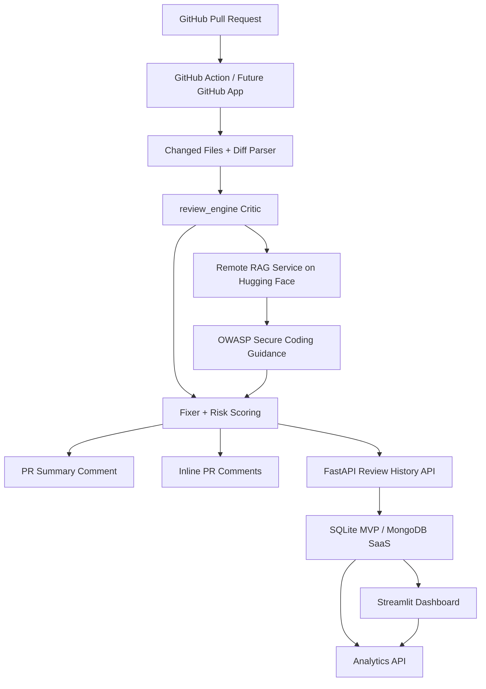
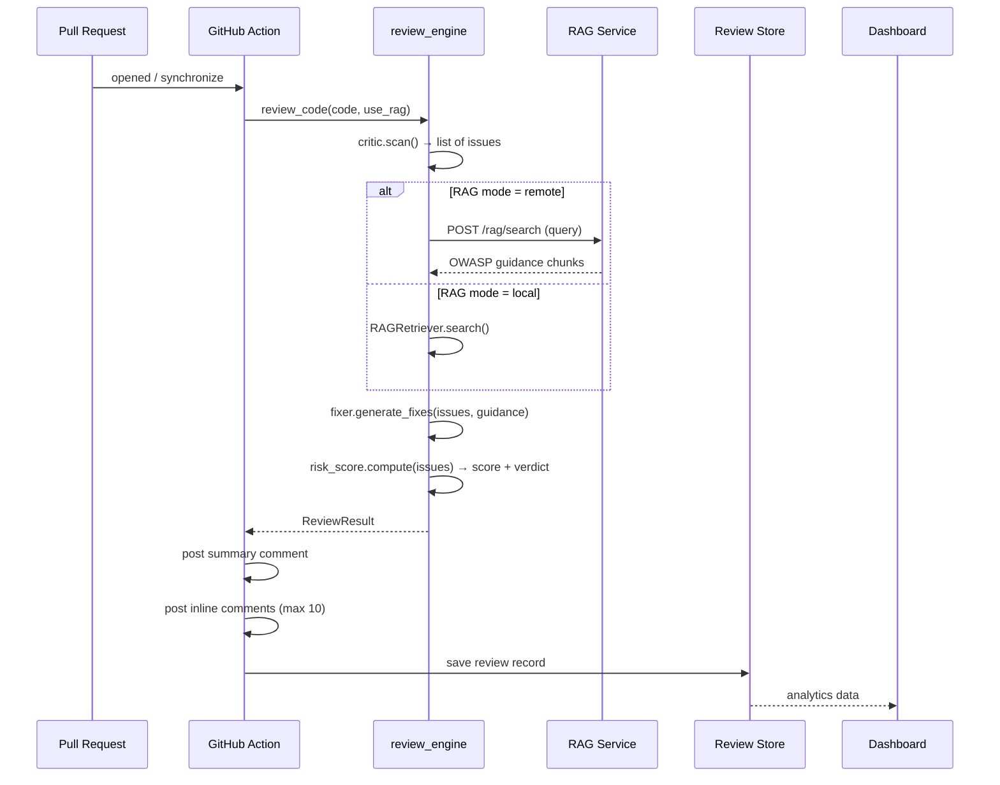
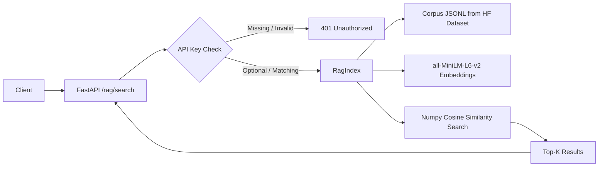
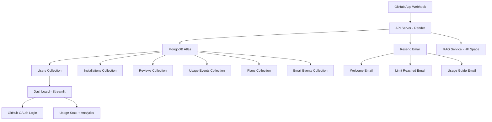

# Architecture

## High-Level System Diagram

## Component Overview

| Component | Language | Role |
|---|---|---|
| `review_engine` | Python | Core: critic, fixer, retriever, risk scorer, pipeline |
| `rag_service` | Python | Standalone FastAPI microservice for RAG (HF Space) |
| `review_store` | Python | SQLite persistence with repository pattern |
| `api` | Python | FastAPI application exposing review + history endpoints |
| `ui` (review) | Python | Streamlit interface for submitting code reviews |
| `ui` (dashboard) | Python | Streamlit interface for analytics and history |
| `scripts/` | Python | CLI, evaluation, deploy, smoke test helpers |
| `.github/workflows/` | YAML | GitHub Action definition |

## Review Pipeline

## RAG Service Architecture

The RAG service:
- Loads the corpus from Hugging Face Dataset (`OMCHOKSI108/CodeSecAudit-RAG`) on startup
- Embeds all chunks using `sentence-transformers/all-MiniLM-L6-v2` (384-dim)
- Searches via numpy cosine similarity (no heavy DB driver)
- Supports optional `X-CodeSec-RAG-Key` auth header (production: required)
- Returns up to `top_k` results with rank, score, title, CWE ID, and content

### Why a separate service?

RAG dependencies (sentence-transformers, PyTorch) add ~7 GB to the Docker image. By deploying the RAG service as a **separate Hugging Face Space**, the main API and dashboard stay lightweight (~500 MB) and call RAG over HTTP when needed.

## SaaS Future Architecture

See [docs/deployment_strategy.md](deployment_strategy.md) and [docs/saas_data_model.md](saas_data_model.md) for full details.

## Key Design Decisions

| Decision | Rationale |
|---|---|
| Rule-based detection (no LLM API) | Zero cost per review, deterministic, no API keys needed |
| Remote RAG via HTTP | Keeps main image ~500 MB; RAG deps live only on HF Space |
| Numpy cosine similarity over ChromaDB | Simpler, no heavy DB driver, 2,833 chunks fit in memory |
| SQLite MVP → MongoDB SaaS | SQLite is zero-config for development; MongoDB for production scale |
| `use_rag=False` in CI | Avoids downloading embedding model on every workflow run |
| Non-blocking CI (exit 0) | Prevents broken builds from false positives |
